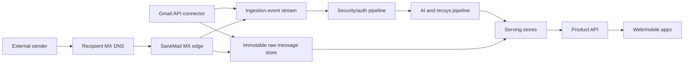
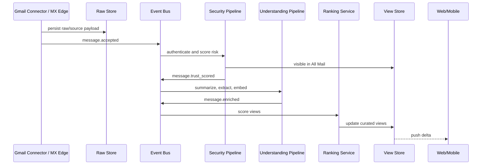

# SaneMail Architecture

SaneMail is an email client and mail processing system built around sane defaults:
the system preserves the legacy ability to inspect every individual message, while
the primary experience is an intelligently curated view that filters junk, groups
related work, and surfaces what deserves attention now.

The design principle is simple: mail delivery must be boring, durable, and
lossless; intelligence can be fast-moving, personalized, and reversible.

## Product Claim

Email should feel less like a raw event stream and more like a chief of staff:
protective by default, clear about what needs action, calm about what can wait,
and always able to show its work.

## Core User Surfaces

- `Today`: a small, ranked set of actionable items.
- `Waiting`: messages where the user is blocked on someone else.
- `Needs Reply`: conversations likely requiring a response from the user.
- `FYI`: relevant but non-actionable updates.
- `Receipts & Notifications`: machine-generated but sometimes useful records.
- `Junk Review`: suspicious, low-priority, or uncertain mail held out of the main flow.
- `All Mail`: faithful legacy view over every accepted message.
- `Explain`: per-message rationale showing why the system surfaced, delayed, grouped, or quarantined a message.

## System Boundary

For the personal-email MVP, SaneMail starts as an intelligence layer over Gmail.
Users connect an existing Gmail account, keep their current address and clients,
and use SaneMail as the curated primary surface.

In the MVP, Gmail is read-only. SaneMail does not write labels, archive mail,
mark messages read, or otherwise mutate the user's Gmail mailbox. All curation
state is owned by SaneMail.

The long-term architecture still supports direct MX hosting for custom domains.
In that mode, SaneMail owns mail after MX acceptance. The same downstream data
plane should process both Gmail-ingested mail and MX-delivered mail.

## Control Plane

The control plane manages configuration, identity, policy, and rollout. It should
not sit in the hot path for accepting mail.

- Domains, MX setup, DKIM keys, MTA-STS policy, TLS certs, and routing.
- Users, aliases, groups, delegated mailboxes, retention settings, and billing.
- Per-user preferences, learned policy, safe/blocked senders, and organization policy.
- Model registry, prompt/config versions, feature flags, and experiment assignment.
- Privacy controls: data residency, retention, export, deletion, audit log, and admin visibility.
- Deliverability operations: queues, bounce policy, abuse controls, IP/domain reputation, and postmaster tooling.
- Gmail OAuth app configuration, scope approval, data deletion flows, and restricted-scope compliance.

## Data Plane

The data plane receives, authenticates, stores, enriches, indexes, and serves mail.
It is optimized for near-real-time processing while never losing the original
message.

### 1. Gmail Connector And MX Edge

For the MVP, Gmail is the first ingestion source.

Gmail connector responsibilities:

- Connect via OAuth.
- Run initial sync over a bounded recent window.
- Run partial sync from Gmail history IDs.
- Use Gmail push notifications with periodic fallback sync.
- Preserve Gmail ids, thread ids, labels, internal dates, and history cursor.
- Treat Gmail labels and mailbox state as source signals only.
- Avoid Gmail mutations in the MVP; `gmail.readonly` should be the target scope.

Custom-domain MX responsibilities:

- Accept SMTP for configured domains.
- Enforce TLS where possible and support MTA-STS for receiving domains.
- Apply cheap pre-accept checks: malformed recipient, domain not hosted, obvious protocol abuse, and rate limits.
- Stamp trace metadata and enqueue the message within the SMTP transaction.
- Return permanent or temporary SMTP failures only when the system is confident.

Output:

- Raw RFC 5322 message bytes.
- SMTP envelope metadata.
- Connection metadata: IP, PTR, HELO/EHLO, TLS, ASN, geo, reputation hints.
- Authentication metadata from SPF, DKIM, DMARC, ARC, and MTA-STS/TLS observations.

### 2. Immutable Mail Log

The first durable write is the source of truth.

- Store raw message bytes in object storage keyed by tenant, mailbox, message id,
  and content hash.
- Store parsed metadata in a relational or document store.
- Emit an append-only `message.accepted` event after durable write.
- Never let classification, summarization, or ranking mutate the original.
- For Gmail-ingested messages, store provider ids and raw/source payload metadata
  so Gmail state can be reconciled without treating SaneMail as the mailbox owner.

### 3. Security And Trust Pipeline

This pipeline produces a risk verdict and evidence bundle. It should run before
expensive LLM work and before the message appears in primary views.

Signals:

- SPF, DKIM, DMARC alignment, ARC chain, TLS, MTA-STS, sender reputation, domain age,
  link reputation, attachment type, executable content, homograph domains, display-name
  spoofing, reply-to mismatch, unsubscribe headers, and historical user relationship.

Verdicts:

- `trusted`: known good sender or authenticated relationship.
- `normal`: no serious concern.
- `bulk`: authenticated machine mail, marketing, newsletters, product notices.
- `suspicious`: possible scam/phishing/spoofing, held from primary attention.
- `malicious`: quarantine by default with explicit recovery path.

Important rule:

Security verdicts must be evidence-first and conservative. An LLM can help explain
or enrich a verdict, but it should not be the only detector for phishing, malware,
or sender authentication failure.

### 4. Message Understanding Pipeline

This is where LLMs and embedding models create the semantic layer.

Derived artifacts:

- Clean text extraction from MIME, HTML, attachments, calendar invites, and quoted replies.
- Thread/conversation graph from `Message-ID`, `References`, `In-Reply-To`, normalized subjects, and semantic similarity.
- Entity extraction: people, companies, dates, tasks, invoices, travel, accounts, files, and commitments.
- Message summary and thread summary.
- Action classification: reply, approve, pay, schedule, read, archive, unsubscribe, ignore.
- Deadline and urgency estimate with calibrated confidence.
- User-intent labels: personal, work, family, finance, legal, shopping, travel, product, social, system.
- Embeddings for messages, threads, senders, entities, and user interactions.

Latency targets:

- `P50 < 2s`: accepted message is visible in All Mail with basic metadata.
- `P50 < 5s`: trust verdict, thread placement, and first-pass category.
- `P50 < 15s`: summary, action guess, ranking features, and curated-view placement.
- Expensive attachment or long-thread analysis can continue asynchronously.

### 5. Recommendation And Ranking Layer

The main interface is a personalized ranking system, not a chronological inbox.

Candidate generation:

- Recent incoming messages and updated threads.
- Threads with open user commitments.
- Messages from important people.
- Calendar-adjacent, deadline-adjacent, and project-adjacent items.
- Semantically similar items to messages the user recently acted on.

Ranking features:

- Trust/risk verdict.
- Relationship strength and recency.
- Directness: To vs Cc vs list/bulk.
- Action likelihood and expected effort.
- Deadline proximity.
- User historical behavior for similar messages.
- Sender and thread novelty.
- Diversity controls so one sender or category cannot dominate.
- Negative signals: marketing, noisy notifications, low engagement, prior archives, prior ignores.

Ranking output:

- A small `Today` slate.
- Section assignment for the rest.
- Per-item rationale.
- Confidence and fallback placement.

Learning loop:

- Capture explicit feedback: pin, hide, not junk, mark important, explain wrong, unsubscribe.
- Capture implicit feedback carefully: open, reply, archive, delay, search, rescue from junk.
- Train per-user preference models for ranking and thresholds.
- Keep global models for cold start, abuse detection, and baseline category quality.
- Use contextual-bandit style exploration only in low-risk presentation choices; never
  explore with security quarantine or scam detection.

### 6. Serving Stores

Serving paths should be optimized by query shape.

- Raw object store: original message bytes and attachments.
- Metadata store: users, mailboxes, messages, threads, labels, security verdicts.
- Product state store: SaneMail-owned categories, rankings, read/progress state,
  feedback, reminders, pins, snoozes, and explanations.
- Search index: lexical search over headers, body, attachments, entities.
- Vector index: semantic retrieval over messages, threads, contacts, and attachments.
- Feature store: sender/user/thread features used by ranking.
- Cache/materialized views: `Today`, `Needs Reply`, `Waiting`, `FYI`, `Junk Review`.

### 7. API And Sync

Expose a product API for the new experience and maintain compatibility surfaces.

- Product API: curated views, rationale, actions, feedback, search, thread details.
- Mail API compatibility: IMAP/JMAP-style all-mail access for legacy clients and exports.
- Push: web/mobile notifications only for high-confidence actionable items.
- Audit API: why a message was quarantined, hidden, ranked, or notified.

## Near-Real-Time Event Flow

## Failure Modes And Defaults

- If AI enrichment fails, show the message in All Mail and retry enrichment.
- If risk scoring is uncertain, keep out of primary views and show in Junk Review.
- If ranking fails, fall back to a conservative chronological inbox minus malicious/quarantined mail.
- If vector search is unavailable, lexical search and metadata views still work.
- If the event bus lags, users can still open All Mail from the metadata store.
- If message parsing is partial, preserve raw bytes and show safe extracted content.

## MVP Architecture

A credible first build can be smaller than the full architecture:

- Gmail API connector with initial sync, partial sync, and push notification handling.
- Postgres for metadata, user state, and materialized views.
- Object storage for raw MIME/source payloads and attachments.
- Queue/event bus for enrichment jobs.
- Open-source mail parser.
- One embedding provider and one vector store.
- One LLM pipeline for summarization, action extraction, and explanations.
- Web app with `Today`, `Junk Review`, `All Mail`, thread view, search, and feedback.
- MX receiver, SPF/DKIM/DMARC/ARC handling, IMAP/SMTP compatibility, and JMAP can
  follow after the Gmail personal MVP proves retention.

## Open Architecture Questions

- What exact Google OAuth scopes are needed for the first public beta?
- What is the privacy stance for model processing: cloud-only with strict vendor controls,
  local-only options, or hybrid?
- How aggressive should default junk filtering be for consumer vs business users?
- Should SaneMail ever mutate Gmail, or should Gmail remain permanently read-only?
- Do we expose IMAP/JMAP after Gmail MVP, or only when SaneMail hosts custom-domain mail?
- What data retention and deletion promises are core to the brand?

## References

- SMTP transport: RFC 5321, https://www.rfc-editor.org/rfc/rfc5321.html
- Internet message format: RFC 5322, https://www.rfc-editor.org/rfc/rfc5322
- DMARC: RFC 7489, https://www.rfc-editor.org/rfc/rfc7489
- ARC: RFC 8617, https://www.rfc-editor.org/rfc/rfc8617
- MTA-STS: RFC 8461, https://www.rfc-editor.org/rfc/rfc8461
- JMAP Mail: RFC 8621, https://www.rfc-editor.org/rfc/rfc8621.html
- Embeddings for search, clustering, recommendations, anomaly detection, and classification:
  https://platform.openai.com/docs/guides/embeddings
- Retrieval-augmented generation: Lewis et al., 2020,
  https://nlp.cs.ucl.ac.uk/publications/2020-05-retrieval-augmented-generation-for-knowledge-intensive-nlp-tasks/
- Two-stage recommendation architecture: Covington et al., 2016,
  https://research.google/pubs/pub45530
